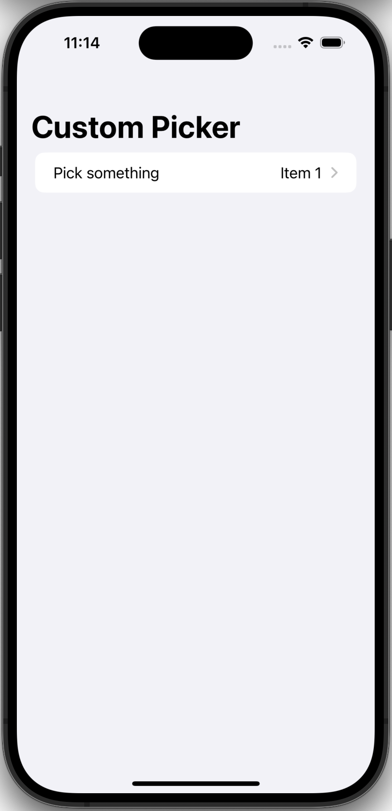

#  Custom Picker

The goal here was to create a custom component that mimics the standard `Picker` but allows both the list items and label to use custom views.
 
This waas heavily based on a great [blog post](https://medium.com/@Barbapapapps/beyond-basics-implementing-a-custom-picker-in-swiftui-88c01e283ac1) by [Julien Sagot](https://medium.com/@Barbapapapps/about): 

